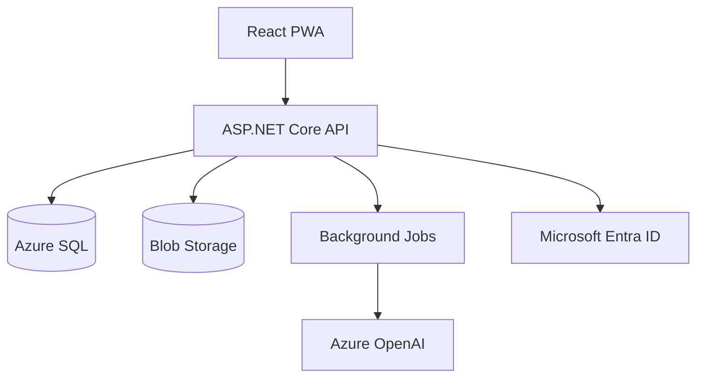

# Technical Architecture

## Decision summary

Build an installable React PWA backed by a modular ASP.NET Core API. Keep domain and application logic independent of Azure-specific services. Start online-first with durable drafts and resumable operations. Add full offline synchronization only after field validation.

## Components

The web client never calls Azure OpenAI and never receives storage credentials beyond a narrow, expiring upload grant when direct-to-blob upload is used.

## Solution boundaries

- `Domain`: entities, value objects, enums and transition rules; no EF or Azure dependencies.
- `Application`: commands, queries, validators, authorization requirements and interfaces.
- `Infrastructure`: EF Core, Blob Storage, Azure OpenAI, background jobs and identity adapters.
- `Api`: HTTP contracts, authentication, problem details and composition root.
- `Web`: React/TypeScript UI, IndexedDB draft store and API client.

## Key decisions

### PWA before Capacitor

Validate browser camera, installability, performance and field workflow first. Keep APIs compatible with a later Capacitor shell. Add native packaging only for a demonstrated requirement such as reliable background upload, managed distribution or deeper device integration.

### Asynchronous AI

Photo upload and item draft creation must complete independently of AI. Analysis is a job with `Queued`, `Running`, `Succeeded`, `Failed`, or `Cancelled` state. The client polls initially; SignalR is optional later. This avoids HTTP timeouts and preserves the photo when the model is unavailable.

### Draft versus item

Client drafts exist in IndexedDB. Server items can also exist in `Draft` publication state while media/AI work completes. A field item is not presented as fully saved until the API confirms it. Local draft IDs and idempotency keys prevent duplicates.

### Controlled master data

Projects own Areas, enabled Trades and Companies. Each Project Trade maps to the responsible company for that project, allowing field capture to infer the company from Trade without another picker. Saved items reference IDs and also snapshot display names so historical reports remain intelligible after reference-data edits.

### Internal and external identities

Employees and Trade Partners authenticate through the configured Microsoft identity tenant/external identity flow. Application authorization is based on project membership and company scope, not email domain alone. External users receive no access until invited and associated with an active company/project membership.

### Concurrency

Every mutable aggregate has a SQL rowversion mapped to a base64 ETag. Update commands require `If-Match`; conflicts return 412 with the current representation.

## Deployment topology

The preferred MVP target is Azure Container Apps running one stateless Docker image containing the ASP.NET Core API and compiled React PWA. Supporting services are Azure SQL, Blob Storage, Key Vault, Application Insights and a queue/background worker. Azure App Service for Containers remains compatible. Front Door/WAF is optional until exposure or scale warrants it.

The container listens on port `8080`, writes no persistent business data to its filesystem and exposes `/health/live` and `/health/ready`. Environment-specific configuration is supplied at runtime. Database migrations run as a separate controlled Container Apps Job or CI/CD step before the new application revision receives traffic.

## Reliability

- Idempotency key on item creation, photo finalization and AI request.
- Retry transient storage/AI failures with exponential backoff and a dead-letter state.
- Health checks distinguish liveness from dependencies.
- Database migration runs as a controlled deployment step, not application startup in production.
- Blob lifecycle rules can move or delete abandoned uploads after an approved retention period.
